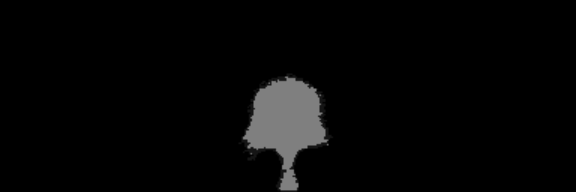

<!-- #region -->
# Med-DDPM: Conditional Diffusion Models for Semantic 3D Brain MRI Synthesis (Whole-Head MRI & 4 Modalities Brain MRIs)


[[Preprint on ArXiv](https://arxiv.org/pdf/2305.18453.pdf)] | [[Paper on IEEE Xplore](https://ieeexplore.ieee.org/document/10493074)] 

This repository hosts the official PyTorch implementation and pretrained model weights for our paper, "Conditional Diffusion Models for Semantic 3D Brain MRI Synthesis," which has been accepted for publication in the IEEE Journal of Biomedical and Health Informatics. Our research focuses on the utilization of diffusion models to generate realistic and high-quality 3D medical images while preserving semantic information. We trained our proposed method on both whole-head MRI and brain-extracted 4 modalities MRIs (<a href="http://braintumorsegmentation.org/">BraTS2021</a>).

For the generation of the 4 modalities (T1, T1ce, T2, Flair), we trained this model using a selected set of 193 high-quality images from the BraTS2021 dataset. We have made our pretrained model weights available for download. Please feel free to use them for further research, and if you use our code or pretrained weights, kindly cite our paper.


## Synthetic Samples for Given Input Mask:

<table>
  <tr>
    <td align="center">
      <strong>Input Mask</strong><br>
      
    </td>
    <td align="center">
      <strong>Real Image</strong><br>
      
    </td>
  </tr>
  <tr>
    <td align="center">
      <strong>Synthetic Sample 1</strong><br>
      
    </td>
    <td align="center">
      <strong>Synthetic Sample 2</strong><br>
      
    </td>
  </tr>
</table>
<!-- #endregion -->

## 🛠️ Setup 

Ensure you have the following libraries installed for training and generating images:

- **Torchio**: [Torchio GitHub](https://github.com/fepegar/torchio)
- **Nibabel**: [Nibabel GitHub](https://github.com/nipy/nibabel)

```
pip install -r requirements.txt
```

## 🚀 Run on Your Own Dataset

Med-DDPM is versatile. If you're working with image formats other than NIfTI (.nii.gz), modify the \`read_image\` function in \`dataset.py\`.

1. Specify the segmentation mask directory with \`--inputfolder\`.
2. Set the image directory using \`--targetfolder\`.
3. If you have more than 3 segmentation mask label classes, update channel configurations in \`train.py\`, \`datasets.py\`, and \`utils/dtypes.py\`.

## 🎓 Training 

Specify dataset paths using \`--inputfolder\` and \`--targetfolder\`:

### Image Dimensions

- Whole-head MRI synthesis: 128x128x128
- Brain-extracted 4 modalities (T1, T1ce, T2, Flair) synthesis (BraTS2021): 192x192x144

```
whole-head MRI synthesis:$ ./scripts/train.sh
(BraTS) 4 modalities MRI synthesis:$ ./scripts/train_brats.sh
```

## 🧠 Model Weights

Get our optimized model weights for both whole-head MRI synthesis and 4-modalities MRI synthesis from the link below:

[Download Model Weights](https://drive.google.com/drive/folders/1t6jk5MrKt34JYClgfijlbNYePIcTEQvJ?usp=sharing)

After downloading, place the files under the "model" directory.

## 🎨 Generating Samples

To create images, follow these steps:

### Image Dimensions

- Whole-head MRI synthesis: 128x128x128
- Brain-extracted 4 modalities (T1, T1ce, T2, Flair) synthesis (BraTS2021): 192x192x144

### Usage

- Set the learned weight file path with \`--weightfile\`.
- Determine the input mask file using \`--inputfolder\`.

```
whole-head MRI synthesis:$ ./scripts/sample.sh
(BraTS) 4 modalities MRI synthesis:$ ./scripts/sample_brats.sh
```

## 📋 ToDo List

Your contributions to Med-DDPM are valuable! Here's our ongoing task list:

- [x] Main model code release
- [x] Release model weights 
- [x] Implement fast sampling feature
- [x] Release 4 modality model code & weights
- [ ] Deploy model on HuggingFace for broader reach
- [ ] Draft & release a comprehensive tutorial blog
- [ ] Launch a Docker image

## 📜 Citation

If our work assists your research, kindly cite us:
```
@ARTICLE{10493074,
  author={Dorjsembe, Zolnamar and Pao, Hsing-Kuo and Odonchimed, Sodtavilan and Xiao, Furen},
  journal={IEEE Journal of Biomedical and Health Informatics}, 
  title={Conditional Diffusion Models for Semantic 3D Brain MRI Synthesis}, 
  year={2024},
  volume={28},
  number={7},
  pages={4084-4093},
  doi={10.1109/JBHI.2024.3385504}}
```

## 💡 Acknowledgements

Gratitude to these foundational repositories:

1. [denoising-diffusion-pytorch](https://github.com/lucidrains/denoising-diffusion-pytorch)
2. [guided-diffusion](https://github.com/openai/guided-diffusion)


```python

```
